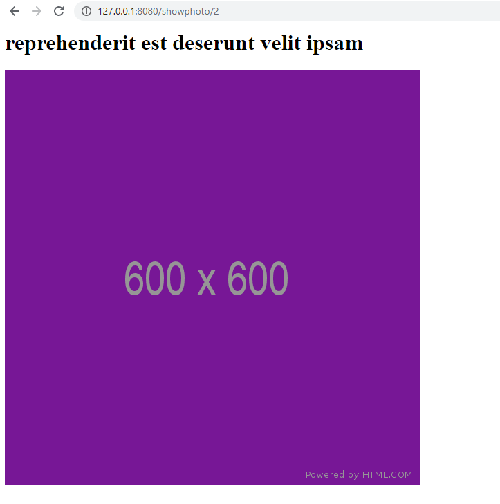

## Purpose

- Using fastify and node-fetch package to fetch JSONPlaceholder data
- Practice using .then(), catch() method and promises to return requests

Webpage Output with route that returns a single photo using the JSONPlaceholder photo web address and node-fetch.  
  

[server-code file](https://github.com/Jiah-design/cit281-lab8/blob/main/lab-08.js)

